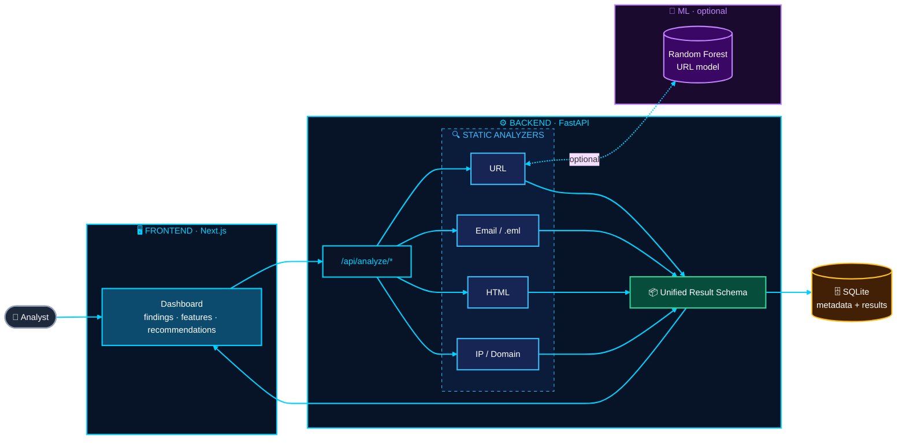
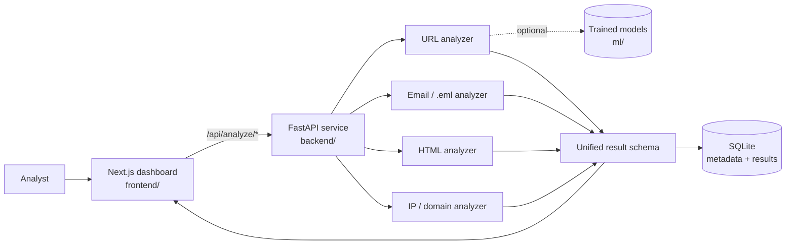

<h1 align="center">PhishGuard ML</h1>

<p align="center"><b>Static, privacy-conscious phishing analysis.</b><br/>
A defensive research and educational platform that examines URLs, emails, <code>.eml</code> files, HTML, IP addresses and domains without ever touching the submitted target.</p>


</p>

<p align="center">
  <a href="#overview">Overview</a> ·
  <a href="#what-it-analyzes">Analyzers</a> ·
  <a href="#architecture">Architecture</a> ·
  <a href="#quick-start">Quick start</a> ·
  <a href="#api-reference">API</a> ·
  <a href="#training-your-own-models">Training</a> ·
  <a href="#security-and-privacy-design">Security</a> ·
  <a href="#limitations">Limitations</a>
</p>

---

## Overview

PhishGuard ML helps researchers and learners understand **why** something looks like phishing. It extracts transparent signals from the input, combines machine learning with conservative rule-based heuristics, and presents the findings, the extracted features and recommendations in a clear dashboard.

The defining design choice is that it is **intentionally static**. It never visits submitted URLs, renders uploaded HTML, executes JavaScript, opens attachments, scans ports or attacks a host. Everything is analyzed as untrusted text, so analyzing a malicious sample cannot compromise the analyst.

> Results are **probabilistic signals, not verdicts**. A low-risk result does not prove safety, and a high-risk result does not establish malicious intent.

## What it analyzes



## Features

- **Hybrid detection:** an optional Random Forest URL model with conservative heuristic fallback when no model is available
- **Transparent output:** findings, extracted features and recommendations are shown, not hidden behind a single score
- **Safe by construction:** no network calls to submitted hosts, no rendering, no script execution, no attachment opening
- **Privacy-minded history:** SQLite stores metadata and results, **not full email bodies by default**
- **Modern dashboard:** Next.js App Router client with a clean results view
- **Reproducible training:** scripts for URL and email models with precision, recall, F1, ROC-AUC and a confusion matrix
- **One-command stack:** run everything with `docker compose up`

## Architecture



| Folder | Role |
|--------|------|
| `frontend/` | Next.js App Router client |
| `backend/` | FastAPI service exposing the analysis API |
| `ml/` | Reproducible training scripts |
| `tests/` | Backend test suite |

The frontend calls `/api/analyze/*`. The backend returns a unified result and writes metadata to SQLite.

## Quick start

### Run locally

**1. Backend**

```bash
cd backend
python3.11 -m venv .venv && . .venv/bin/activate
pip install -r requirements.txt
uvicorn app.main:app --reload --port 8000
```

**2. Frontend** (in a second terminal)

```bash
cd frontend
npm install
npm run dev
```

Open **http://localhost:3000**.

### Run with Docker

```bash
docker compose up
```

## API reference

| Method | Endpoint | Body |
|--------|----------|------|
| `POST` | `/api/analyze/url` | `{ "url": "https://example.com" }` |
| `POST` | `/api/analyze/email` | `subject`, `body`, `sender`, `reply_to` |
| `POST` | `/api/analyze/eml` | multipart `.eml` upload |
| `POST` | `/api/analyze/html` | multipart HTML upload |
| `POST` | `/api/analyze/ip` | `{ "value": "192.0.2.1" }` |
| `POST` | `/api/analyze/domain` | `{ "value": "example.com" }` |
| `GET` | `/api/history` | none |
| `GET` | `/api/health` | none |

Example:

```bash
curl -X POST http://localhost:8000/api/analyze/url \
  -H "Content-Type: application/json" \
  -d '{ "url": "https://example.com" }'
```

## Training your own models

Keep datasets **private and outside Git**. Model binaries and datasets are git-ignored.

| Model | Required CSV columns |
|-------|----------------------|
| URL | `url`, `label` |
| Email | `text`, `label` |

```bash
PYTHONPATH=. python ml/training/train_url_model.py path/to/urls.csv
PYTHONPATH=. python ml/training/train_email_model.py path/to/emails.csv
```

Training prints **precision, recall, F1, ROC-AUC and a confusion matrix**. No accuracy claims are made without evidence: evaluate on your own representative data before trusting any model.

## Testing and build

```bash
cd backend && pytest ../tests
cd frontend && npm run build
```

## Security and privacy design

| Principle | How it is applied |
|-----------|-------------------|
| **Static analysis only** | Never visits URLs, renders HTML, executes JavaScript or opens attachments |
| **No active scanning** | No port scanning and no attacks on any host |
| **No outbound contact** | No submitted host is ever contacted |
| **Untrusted input** | Inputs are bounded by length and a **5 MB file limit** |
| **Minimal storage** | History keeps metadata and results, not full email bodies by default |
| **Restricted CORS** | Limited to local frontend origins |
| **Secrets** | Deployment secrets are configured through environment variables |

## Limitations

- Output is a **probabilistic signal**, never a verdict.
- A low-risk result does **not** prove safety.
- A high-risk result does **not** establish malicious intent.
- Model quality depends entirely on the data you train it with.

## Roadmap

- Calibrate trained probabilities
- Add privacy-preserving enrichment as a separately permissioned service
- Add authenticated multi-user history
- Expand language coverage
- Evaluate against a documented, representative dataset

## Screenshots

Screenshots will be added when the research portfolio is published.

## Author

**Ahmed Tarek Salah**, Cybersecurity Researcher, building at [PYRAMID-SEC](https://github.com/PYRAMID-SEC).

[](https://www.linkedin.com/in/ahmed-t-756505379/)
[](https://hackerone.com/thaqib)
[](https://github.com/PYRAMID-SEC)
